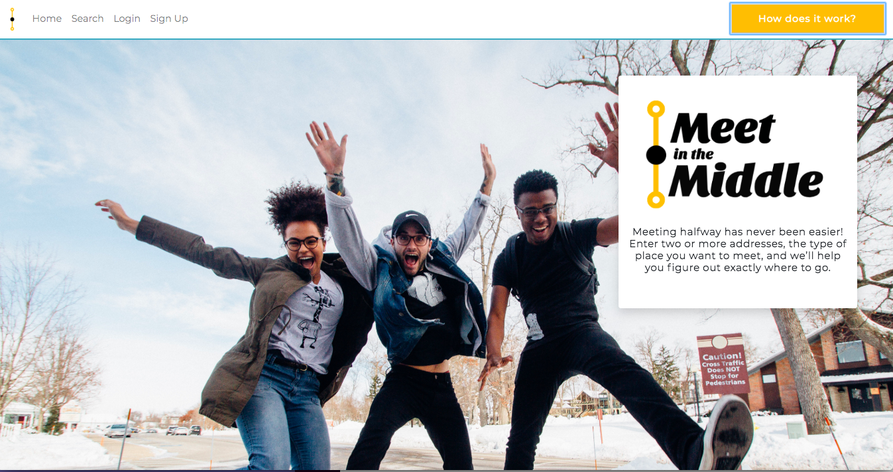
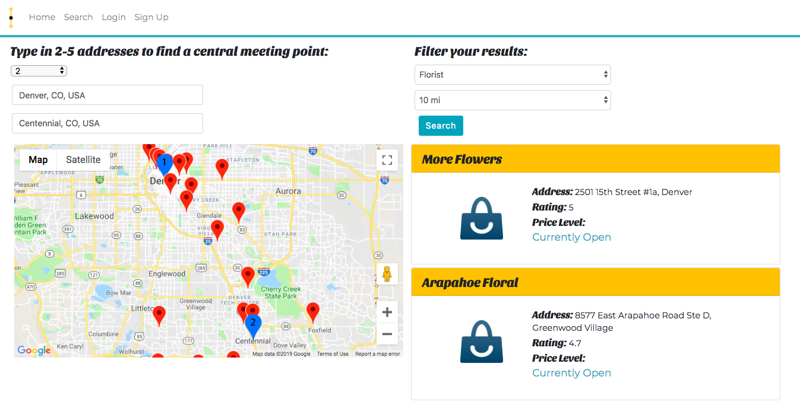

# Meet in the Middle
Have you ever wanted to go to dinner with a group of friends but have struggled to find a central location? Now you can! Enter up to five addresses and quickly determine the best place to Meet in the Middle. You can filter your search by selecting a specific location type or by adjusting the search radius. The app works for US and international locations!

## react-auth
react app with passport authentication

[Check out the app here](https://meet-inthe-middle.herokuapp.com/)

## Requirements
* mongoDB
* npm or yarn
* Node
* Terminal or bash

## built with
* React.js
* passport.js
* Express
* mongodb
* mongoose
* Node
* reactstrap
* animista css

## Setup Instructions
1. clone the repo 
    * `git clone https://github.com/ksknight85/MeetInTheMiddle`
    * `cd react-auth`
2. install dependencies
    * `npm run install`
3. Start mongo server by opening a seperate terminal or bash window and run:
    * `mongod`
4. Start the development server
    * `npm run start`
5. Happy Hacking!

## Contributors
    Jenn Campbell
    Kevin Knight
    Dylan Le Clair
    Haley Brown
